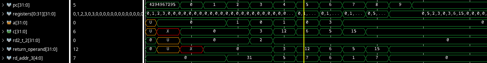

# Custom Risc-v core 

A project to learn basics ideas of designing a chip from start. 
This is meant to be done first in C then in a hardare description language
(Vhdl or Verilog) and the to run on a FPGA.

## Example 
```
add  x5, x1, x2
addi x7, x5, 12
addi x6, x1, 5
addi x1, x4, 5
addi x7, x5, 12
```

Output image : 


## Basics ideas : 
- 32 bit processor that can handle demical, floating, vector operations
- out-of-order , 5-stage pipeline, basic memory system 

## Things to implement
- [ ] Float Point Unit (Fpu) 
  - [ ] fadd, fmult,mmult(matrix multiplication) to 32 bit IEEE float
  - [ ] Conv, Broadcast
- [x] ALU 
  - Has to do add, sub, and, or, not, xor, mul
- [x] Base instruction set
- [x] Pipeline
- [ ] Out-of-order with ROB
- [ ] Multiplication and Division (M extension)
- [ ] Atomic instructions (A extension)
  - As a start not multithread or multicore yet.
- [ ] Floationg point Signle-Precision (F extension)
- [ ] Vector Operators ( V extension) 

## ALU  
ALU uses Vhdl - 2008 for the operation sra
- ADDI | ADD , SUB
- SLTI | SLT
- SLTIU | SLTU
- XORI | XOR
- ORI | OR
- ANDI | AND
- SLLI | SLL
- SRLI, SRAI | SRL, SRAI

## __Assembler__
This is a basic assembler to make me easily populate the core instructions. I opted to create 
a one from scratch, and not a cross compiler, its simpler and allows for a more direct approach
to combat specific problems. The cross compiler fill the case with some junk instructions for reset
and for other reasons, not relevant to the problem. 

My version does not support labels yet, so we can relative branch addresses to change the instruction 
order.

#So far from MIT
- [X] Base instruction set
  - [x] Reg to Reg
  - [x] Reg to Imm
  - [x] Load 
  - [x] Store
  - [x] Branch
  - [x] Jump
  - [ ] Relative jump
  - [ ] Lui and Auipc
- [X] Pipelined
  - [x] Reg to Reg
  - [x] Reg to Imm
  - [ ] Load 
  - [ ] Store
  - [ ] Branch
  - [ ] Jump

## Testing  
- To take the test from https://github.com/riscv-software-src/riscv-tests I changed the cross compiler, but still uses irelevant commands such as csrr,auipc, fence
- Better to use the custom assembler to manipulate the instructions better


## Things to consider to implement (Not yet desiced) 
- DMA
- Transactional Memory

## References
- [Risc-V documentation](https://riscv.org/wp-content/uploads/2017/05/riscv-spec-v2.2.pdf)
- [MIT Architecture Course](https://ocw.mit.edu/courses/6-004-computation-structures-spring-2017/pages/c13/c13s1/#30)
